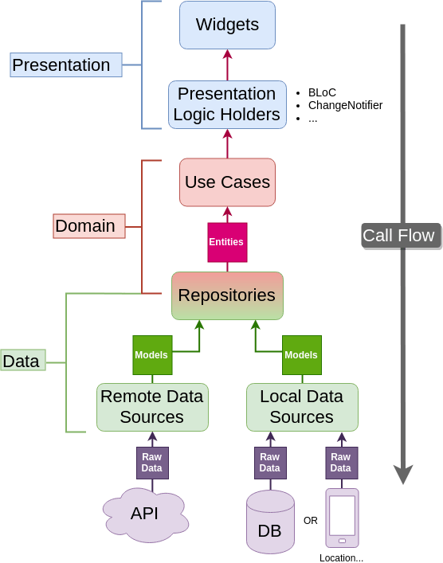

# Flutter Clean Architecture Posts App

### This project is an application example to Clean Architecture
### Apply to: shared_preferences
### Use state management: Bloc
### Gat data from Api [{JSON} Placeholder](http://jsonplaceholder.typicode.com/)

## 
# Screenshot
     
